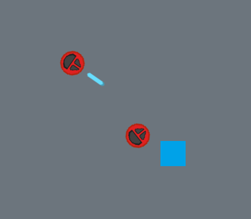
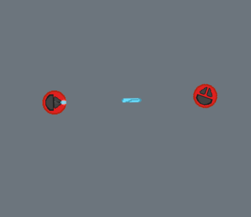
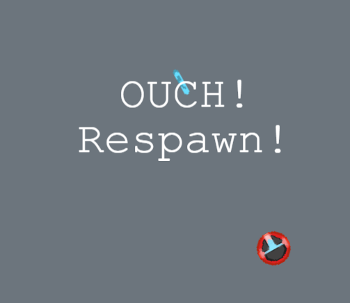

# Active-Actove Geo-Distributed Multiplayer top-down arcade shooter

[Redis Labs "Build on Redis" 2021 hackathon](https://hackathons.redislabs.com/hackathons/build-on-redis-hackathon) participation project.

World`s first Active-Actove Geo-Distributed* Multiplayer top-down arcade shooter. App is made to showcase Redis and Redis Labs modules and their capabilities. This game is literally built on Redis!** 

*Fully supporting Active-Active Geo-Distributed redis infrastructure once deployed using Redis Labs deployments.

**Most of game event interactions are handled by calling RedisGears functions.

Join the arena, avoid projectiles by moving around and dominate others by landing hits!

<a></a>
<a></a>
<a></a>

---

## How it Works?
### Architecture

<a></a>
<a></a>
<a></a>

Application stack consists of three main components:
* JavaScript client
    - uses phaser 3 game engine for rendering and physics simulations;
    - captures user inputs and sends inputs to the backend;
* Node.js backend
    - Serves as a WebServer;
    - Provides a WebSocket server;
    - Enables Redis API;
    - Ensures User -> Redis -> User event communication
* Redis
    - Uses RedisGears to define game functions (functionality);
    - Uses RediSearch to enable robust querying experience;
    - Stores game state (enables data decoupling from node.js backend)
    - Validates user inputs (using RedisGears functions)
    - Provides Game API (again, RedisGears)


## Running locally using docker-compose
```
docker-compose up --build
```


## Use of redis
GG

## Utility & Usefulness
GG

TODO:
    - actual game events
    - moderate game events
    - deploy on kubernetes?


## Architecture
