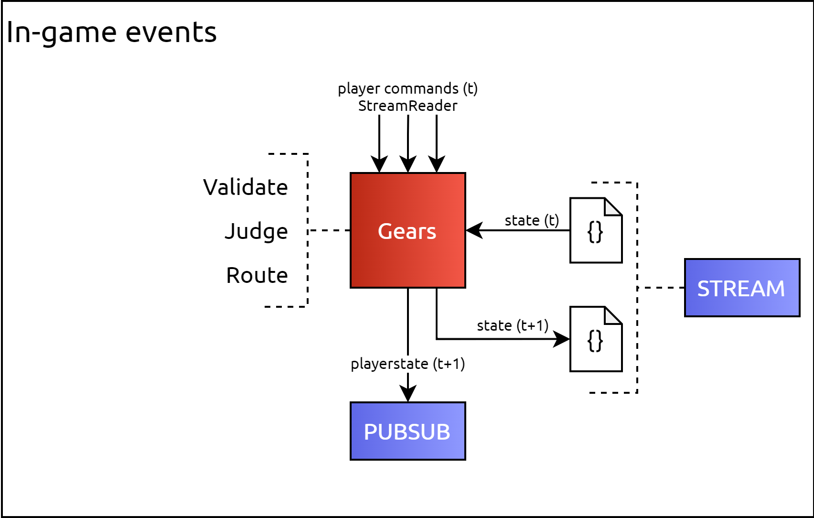
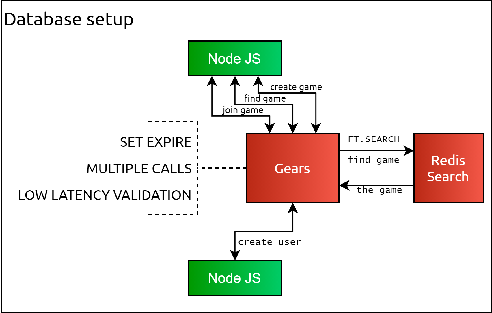

# Active-Active Geo-Distributed Multiplayer top-down arcade shooter

[Redis Labs "Build on Redis" 2021 hackathon](https://hackathons.redislabs.com/hackathons/build-on-redis-hackathon) participation project.

World`s first Active-Active Geo-Distributed* Multiplayer top-down arcade shooter. App is made to showcase Redis and Redis Labs modules and their capabilities. This game is literally built on Redis!** 

*Fully supporting Active-Active Geo-Distributed redis infrastructure once deployed using Redis Labs deployments.

**Most of game event interactions are handled by calling RedisGears functions.

Join the arena, avoid projectiles by moving around and dominate others by landing hits!


---


## How it Works?
### Architecture

<a></a>
<a></a>
<a></a>

**Application stack consists of three main components:**
* JavaScript client:
    - uses phaser 3 game engine for rendering and physics simulations;
    - captures user inputs and sends inputs to the backend;
* Node.js backend:
    - Serves as a WebServer;
    - Provides a WebSocket server;
    - Enables Redis API;
    - Ensures User -> Redis -> User event communication;
* Redis:
    - Uses RedisGears to define game functions (functionality);
    - Uses RediSearch to enable robust querying experience;
    - Stores game state (enables data decoupling from node.js backend);
    - Validates user inputs (using RedisGears functions);
    - Provides Game API (again, RedisGears).

## RedisGears function list:

- `create_new_game` (CommandReader, args: [`user_id`], optional: [`private`, `secret`]):
    - Creates a hash (`HSET`);
    - Creates an expiry for the hash (`EXPIRE`);
    - Triggered by calling `RG.TRIGGER create_new_game USER:p1_uid 1 secret123`;
    - returns `game_id`;
- `create_new_user` (CommandReader, args: [`uid`], optional: [`settings`, `secret`]):
    - Creates a hash (`HSET`) ;
    - Creates an expiry for the hash (`EXPIRE`);
    - Triggered by calling `RG.TRIGGER create_new_user p1_uid Player1 '' aahh`;
    - returns `user_id`;
- `find_game` (CommandReader, optional: [`game_id`]):
    - If game_id provided then executes `FT.SEARCH` (see RediSearch bellow);
    - If game not found then trigger `create_new_game`;
    - Triggered by calling `RG.TRIGGER find_game p1_uid`;
    - returns `game_id`;
- `join_game` (CommandReader, args: [`user_id`, `game_id`]):
    - Assigns the user to the game_instance (`HSET`)
    - Increments player count of the game_instance (`HINCRBY`);
    - Triggered by calling `RG.TRIGGER join_game p1_uid g1_gid secret123`;
    - returns `game_id`;
- `leave_game` (CommandReader, args: [ `user_ud`, `game_id`]):
    - Deletes hash field (`HDEL`);
    - Decrements player count of the game instance (`HINCRBY`);
    - Triggered by calling ` RG.TRIGGER leave_game p1_uid g1_gid`;
    - returns `game_id`;
- `user_authorized` (CommandReader, args: [`user_ud`, `game_id`]):
    - Executes three (`HGET`) calls to determine if user is a part of the game instance;
    - returns `game_id`;
- `player_actions` (StreamReader, args: [`action`, `action_args`]):
    - Parses an event received from the user; 
    - Adds a state to `game_states` stream (`XADD`);
    - Publishes state change to subscribers (`PUBLISH`);
    - Triggered by calling `XADD player_actions:g1_gid action p action_args "10,100,0"`.


## RediSearch

Used to find available games:
```
FT.CREATE GAME ON HASH PREFIX 1 GAME: SCHEMA owner TEXT secret TEXT private NUMERIC SORTABLE playercount NUMERIC SORTABLE

FT.CREATE USER ON HASH PREFIX 1 USER: SCHEMA name TEXT settings TEXT secret TEXT
```

```
FT.SEARCH "GAME" "(@playercount:[0 1000])" SORTBY playercount DESC LIMIT 0 1
```


## Running locally


### Prerequisites

- docker
- docker-compose


### Running
Run following commands from the online_game directory
```
docker-compose up
```

access online WebServer via http://127.0.0.1:8080


### Debuging / Troubleshooting
If you are connected to the game, but player charecter is not showing then you most likeley don't have a connection to the WebSocket server ws://127.0.0.1:8002.

If you are being kicked out of the game, then congratulations, you most likely have found a bug,


**General steps**

To fully reset the states:
Try removing the redis dump.rdb located in `./redis/redis_data/dump.rdb`.
```
rm redis/redis_data/dump.rdb
```
or 

```
sudo rm redis/redis_data/dump.rdb

```
then run start up containers
```
docker-compose up --build
```


**Other troubleshooting**

Perhaps ports `8080` or `8082` are already registered. You can change port mapping in `docker-compose.yaml` to, for example, `8081:8080` and `8083:8002`. 

```
  backend:
    build:
      dockerfile: ./dockerfiles/Dockerfile_node_backend
      context: .
    environment:
      - NODE_ENV=development
    volumes: 
      - ./game_conf.json:/game_config/game_conf.json
    ports:
      - 8080:8080
      - 8082:8082
    restart: always
```

### Cleanup

Run following commands to clean up your running environment.
```
docker-compose down
rm redis/redis_data/dump.rdb
```
or 

```
docker-compose down
sudo rm redis/redis_data/dump.rdb

```
